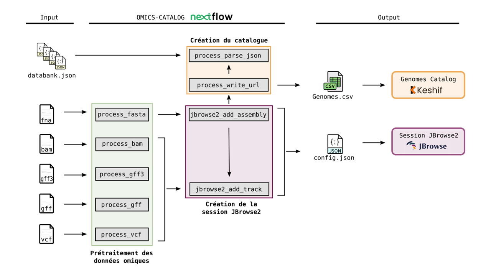

# **OMICS-CATALOG: a FAIR toolkit for fast visualization of omics data and metadata**.

[](https://www.nextflow.io/)
[](https://sylabs.io/docs/)
[](https://ifremer-bioinformatics.github.io/)

## Introduction

OMICS-CATALOG is based on a [Nextflow](https://www.nextflow.io) pipeline which implements a genome browser session to visualize omics data, and sets up an interactive genomes catalog based on the [Keshif](https://github.com/adilyalcin/keshif) data visualization tool. The catalog provides the list of available model organisms, along with metadata such as lineage, genome version, submitter, etc. To visualize omics data of  model organisms, the catalog gives access to the genome browser session, implemented using [JBrowse2](https://jbrowse.org/jb2/docs/quickstart_web) viewer.

The OMICS-CATALOG pipeline can run tasks across multiple compute infrastructures in a very portable manner. It comes with singularity containers making installation trivial and results highly reproducible.

## Quick Start

i. Install [`nextflow`](https://www.nextflow.io/docs/latest/getstarted.html#installation)

ii. Install [`Singularity`](https://www.sylabs.io/guides/3.0/user-guide/) for full pipeline reproducibility

iii. Install [`JBrowse2`](https://jbrowse.org/jb2/docs/quickstart_web) 

iv. Download the pipeline and test it on a minimal dataset with a single command

```bash
cd gviewer
nextflow run main.nf -profile test,singularity -c <institute_config_file>
```

> To use this workflow on a computing cluster, it is necessary to provide a configuration file for your system. For some institutes, this one already exists and is referenced on [nf-core/configs](https://github.com/nf-core/configs#documentation). If so, you can simply download your institute custom config file and simply use `-c <institute_config_file>` in your command. This will enable either `docker` or `singularity` and set the appropriate execution settings for your local compute environment.

v. Start running your own analysis!

```bash
cd gviewer
nextflow run main.nf -profile custom,singularity [-c <institute_config_file>]
```

See [usage docs](gviewer/docs/usage.md) for a complete description of configuration file requirements and all of the options available when running the pipeline.

## Documentation

This workflow comes with documentation about the pipeline, found in the `docs/` directory:

1. [Introduction](gviewer/docs/usage.md#introduction)
2. [Pipeline installation](gviewer/docs/usage.md#install-the-pipeline)
    * [Local installation](gviewer/docs/usage.md#local-installation)
    * [Adding your own system config](gviewer/docs/usage.md#adding-your-own-system-config)
3. [Pre-requisites before running the pipeline](gviewer/docs/usage.md#pre-requisites-before-running-the-pipeline)
4. [Running the pipeline](gviewer/docs/usage.md#running-the-pipeline)
5. [Output and how to interpret the results](gviewer/docs/output.md)
6. [Troubleshooting](gviewer/docs/troubleshooting.md)

Here is an overview of the many steps available in omics-catalog pipeline:




And here is an oversview of the catalog 


## Requirements

To use OMICS-CATALOG, all tools are automatically installed via pre-built singularity images available at [SeBiMER ftp](ftp://ftp.ifremer.fr/ifremer/dataref/bioinfo/sebimer/tools/OMICS-CATALOG/); these images are built from recipes available [here](gviewer/containers).
The singularity image containing JBrowse2 is used to execute JBrowse2 commands according to the CLI, for setting up the session. However, to access the session you must install JBrowse2 by yourself on your computer. See [usage docs](gviewer/docs/usage.md) for more information.

## Credits

OMICS-CATALOG is written by [SeBiMER](https://ifremer-bioinformatics.github.io/), the Bioinformatics Core Facility of [IFREMER](https://wwz.ifremer.fr/en/).

## Contributions

We welcome contributions to the pipeline. If such case you can do one of the following:
* Use issues to submit your questions 
* Fork the project, do your developments and submit a pull request
* Contact us (see email below) 

## Support

For further information or help, don't hesitate to get in touch with the omics-catalog developpers: 


